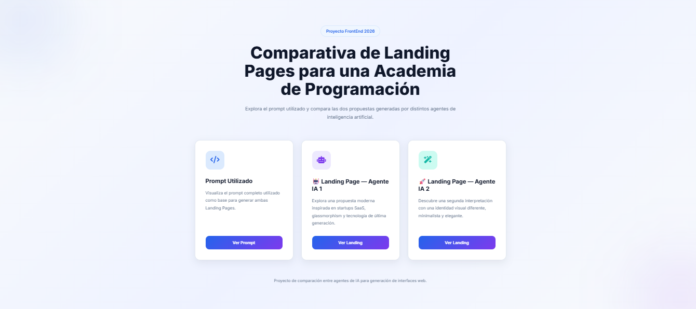
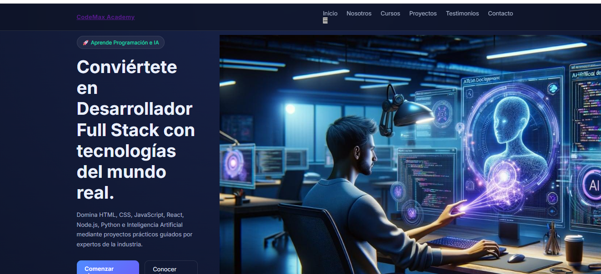
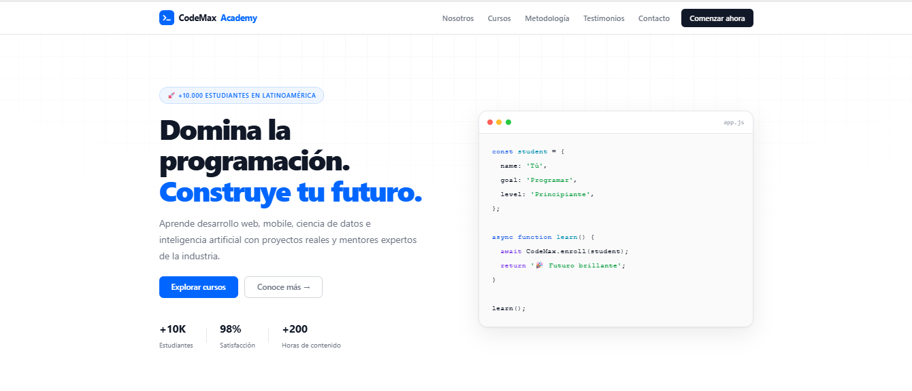

# 🚀 CodeMax Academy — Comparativa de Landing Pages IA

Proyecto FrontEnd desarrollado con **HTML5, CSS3 y JavaScript Vanilla**, que compara dos landing pages generadas por distintos enfoques de Inteligencia Artificial, manteniendo la misma estructura y contenido para análisis UX/UI.

---

## 📌 Descripción

Este proyecto simula el trabajo de un equipo FrontEnd profesional, donde se desarrollan dos versiones visuales de una misma landing page para una academia de programación llamada **CodeMax Academy**.

El objetivo es analizar cómo diferentes estilos visuales impactan en la experiencia de usuario sin modificar la estructura ni el contenido.

---

## 🚀 Link al Deploy

👉 **[Ver Deploy en Vercel](https://codemax-landing.vercel.app/)**

---


## 🎯 Objetivo del proyecto

- Comparar dos enfoques de diseño UI generados por IA
- Mantener la misma estructura de contenido en ambas versiones
- Aplicar principios de UX/UI modernos
- Desarrollar un hub de navegación para visualización comparativa
- Practicar buenas prácticas de FrontEnd sin frameworks

---

## 🧱 Estructura del proyecto
```
/
├── index.html
├── prompt.html
├── landing-ai-1.html
├── landing-ai-2.html
│
├── css/
│ ├── styles.css
│ ├── landing-ai-1.css
│ └── landing-ai-2.css
│
├── js/
│ └── app.js
│
└── assets/
├── images/
└── icons/
```

---

## 🧪 Tecnologías utilizadas

- HTML5 semántico
- CSS3 (Flexbox + Grid + Variables)
- JavaScript Vanilla
- Responsive Design (Mobile First)
- Animaciones CSS
- Glassmorphism (Landing AI 1)
- Diseño editorial minimalista (Landing AI 2)

---

## 🎨 Estilos de las Landing Pages

### 🤖 Landing AI 1
- Estilo futurista SaaS
- Glassmorphism
- Paleta oscura
- Inspiración: Stripe, Vercel, Framer, Linear

### 🚀 Landing AI 2
- Estilo minimalista editorial
- Inspiración Apple / Notion / Linear
- Paleta clara y limpia
- Diseño centrado en legibilidad

---

## 📱 Características

- Diseño completamente responsive
- Navegación entre páginas
- Animaciones suaves (fade + hover + scroll)
- Componentes reutilizables
- Accesibilidad básica (WCAG AA)
- SEO básico implementado
- Optimización para Lighthouse

---

## 📄 Página principal (Hub)

El `index.html` funciona como un hub de comparación con:

- Acceso al prompt utilizado
- Landing Page IA 1
- Landing Page IA 2

---

## 📸 Vistas previa

## Página de Portada



## Página de la Landing AI 1



## Página de la Landing AI 2




---

## 👨‍💻 Autor

Proyecto desarrollado por **Maximiliano Carlos Ratti**, como práctica de FrontEnd para academia de programación.

---

## 📌 Notas

- No utiliza frameworks
- Todo el diseño está hecho con HTML, CSS y JS puro
- El objetivo es comparar estilos visuales, no contenido

---

## ⚡ Estado del proyecto

✔ Completado  
✔ Responsive  
✔ Listo para entrega académica